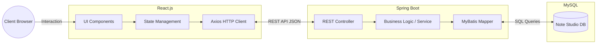

# 📓 NOTE_STUDIO (노트 스튜디오)

> "코드에 버그가 없다면, 아직 충분히 복잡하지 않은 것이다."
> 코딩 테스트 및 알고리즘 문제 풀이 역량 강화를 위한 **개발자 맞춤형 오답노트 플랫폼**

 

## 🎯 프로젝트 기획 배경
알고리즘 문제(백준, 프로그래머스 등)를 풀고 난 후, 흩어져 있는 오답 원인과 핵심 개념(Concept)을 한곳에 체계적으로 기록하고 복습하기 위해 기획됨. 
일반적인 메모 앱과 달리, 개발자의 시각에 맞춘 IDE 감성의 UI/UX를 제공함.

## 🗓 프로젝트 기간
**2026.05.17 ~ 2026.05.28 (약 X주/개월)**
* **기획 및 설계:** 2026.05.17 ~ 2026.05.19 (요구사항 정의, API 명세, 화면 설계)
* **기본 기능 개발:** 2026.05.19 ~ 2026.05.26 (Spring Boot API 및 React UI 구현)
* **테스트 및 리팩토링:** 2026.05.26 ~ 2026.05.28 (트러블 슈팅 및 버그 수정)

 

## 🛠 1. 기술 선택과 선택 이유 (Tech Stack)

### Backend
- **Java / Spring Boot**
  - **선택 이유:** 안정적인 RESTful API를 빠르게 구축할 수 있으며, Controller-Service-Repository 계층형 아키텍처를 통해 비즈니스 로직의 응집도를 높이고 유지보수를 용이하게 하기 위해 선택함.
- **MySQL & MyBatis**
  - **선택 이유:** 유저 정보와 오답 노트 간의 관계를 무결성 있게 관리하기 위해 RDBMS인 MySQL을 선택함. 또한, 복잡한 동적 쿼리를 XML 기반으로 분리하여 직관적으로 제어하기 위해 MyBatis를 활용함.
- **Bcrypt & JavaMailSender**
  - **선택 이유:** 사용자의 비밀번호를 단방향 해시로 암호화(Bcrypt)하여 DB 탈취 위험에 대비하고, 실제 동작하는 이메일 난수 인증 시스템(JavaMailSender)을 구현하여 애플리케이션의 보안 수준을 높이기 위해 도입함.

### Frontend
- **React.js**
  - **선택 이유:** 오답 노트 뷰어, 다크/라이트 모드 전환 등 상태(State) 변화가 잦은 UI를 독립적인 컴포넌트 단위로 분리하여 렌더링 효율을 높이고 재사용성을 극대화하기 위해 채택함.
- **Vanilla CSS (CSS Variables)**
  - **선택 이유:** 무거운 외부 UI 라이브러리 의존도를 낮추고, CSS 변수(`var()`)를 활용해 전역 테마(다크/라이트 모드)를 가볍고 직관적으로 제어하기 위해 사용함.

 

## 🏗 2. 아키텍처 다이어그램 (System Architecture)
전체적인 데이터 흐름과 시스템 구조. 프론트엔드와 백엔드가 분리된 REST API 구조로 통신함.

 

## ✨ 3. 핵심 기능 설명 (Core Features)

### 3-1. RESTful API 명세 (Swagger UI 적용)
직관적이고 일관성 있는 엔드포인트를 구성하였으며, 프론트엔드와의 원활한 협업 및 API 테스트를 위해 **Swagger UI**를 적용하여 문서화함.

**👤 로그인 및 회원 관련 API (Users)**

| Method | URI (Endpoint) | 설명 및 핵심 로직 |
| :---: | :--- | :--- |
| `POST` | `/api/users/login` | 입력받은 ID/PWD 검증 및 인증 상태 부여 |
| `POST` | `/api/users` | 신규 유저 정보(ID, PWD, 닉네임) DB 저장 |
| `GET` | `/api/users/{id}` | 마이페이지 진입 시 해당 유저의 정보 로드 |
| `PUT` | `/api/users/{id}` | 닉네임, 비밀번호 등 회원 정보 업데이트 |
| `DELETE` | `/api/users/{id}` | DB에서 유저 정보 및 작성한 오답 노트 CASCADE 삭제 |
| `PUT` | `/api/users/change-pwd`| 기존 비밀번호 검증 통과 시 새 비밀번호로 변경 |

**📓 오답 노트 관련 API (Notes)**

| Method | URI (Endpoint) | 설명 및 핵심 로직 |
| :---: | :--- | :--- |
| `POST` | `/api/notes` | 문제 정보 및 피드백(틀린 이유 등) 신규 저장 |
| `GET` | `/api/notes` | 로그인 유저가 작성한 전체 오답 노트 리스트 조회 |
| `GET` | `/api/notes/{id}` | 특정 노트 클릭 시 상세 내용(해결 로직 등) 조회 |
| `PUT` | `/api/notes/{id}` | 이미 작성된 특정 오답 노트의 내용 수정 업데이트 |
| `DELETE`| `/api/notes/{id}` | 불필요한 특정 오답 노트를 DB에서 삭제 처리 |

 

 

### 3-2. 화면 구성 및 주요 기능

| 메인 대시보드 (Dark) | 메인 대시보드 (Light) |
| :---: | :---: |
|  |  |
| **회원가입 & 이메일 인증** | **노트 작성 & 상세 보기** |
|  |  |

- **생산성 중심 대시보드:** 로그인한 유저를 위한 환영 인사, 잔디밭(활동 기록) UI, 그리고 'TODAY'S REVIEW TASK'를 통한 직관적인 목표 확인 기능 제공.
- **개발자 맞춤형 뷰어:** 문제 번호, 핵심 개념, 오답 원인, 코드를 세분화하여 기록할 수 있으며, 실제 IDE 환경과 유사한 코드 스니펫 뷰어 제공.

## 🚀 4. 트러블 슈팅 (Trouble Shooting)

### 🔥 Issue 1. [Backend] Spring Boot - React 연동 시 CORS 차단 문제
- **문제:** 로컬 환경에서 React(Port 3000)가 Spring Boot(Port 8080)로 API를 요청할 때, CORS(교차 출처 리소스 공유) 정책 위반으로 에러가 발생하며 통신이 차단됨.
- **원인:** 브라우저의 보안 정책인 SOP(Same-Origin Policy)로 인해, 프로토콜, 호스트, 포트 중 하나라도 다르면 외부 리소스 접근을 기본적으로 차단하기 때문.
- **시도:** 각 Controller 클래스나 메서드 상단에 `@CrossOrigin` 어노테이션을 붙여 단편적인 해결을 시도했으나, API 엔드포인트가 늘어날 때마다 중복 코드가 발생하여 유지보수성 저하 우려.
- **해결:** Spring Boot의 `WebMvcConfigurer` 인터페이스를 구현한 전역 설정 클래스를 생성하여 `addCorsMappings`를 통해 프론트엔드 도메인과 필요한 HTTP 메서드를 일괄 허용함.
- **배운 점:** 프레임워크 레벨에서 제공하는 글로벌 설정의 중요성을 깨달았으며, 브라우저 보안 정책(SOP/CORS)의 동작 원리를 명확히 이해함.

### 🔥 Issue 2. [Backend] MyBatis 데이터베이스 매핑 불일치 현상
- **문제:** API 조회 시 DB에 정상적으로 저장된 데이터임에도 불구하고, 특정 필드(ex. `wrong_reason`)가 JSON 응답에서 `null`로 반환됨.
- **원인:** DB의 컬럼명은 `snake_case`로 설계되었으나, Java의 DTO 필드명은 `camelCase`로 선언되어 있어 MyBatis가 이를 자동으로 매핑하지 못함.
- **시도:** SQL 쿼리문에서 `SELECT wrong_reason AS wrongReason`처럼 별칭(Alias)을 부여하려 했으나, 쿼리가 길어지고 개발자의 휴먼 에러 발생 확률이 높아짐.
- **해결:** `application.properties` 파일에 `mybatis.configuration.map-underscore-to-camel-case=true` 속성을 추가하여 프레임워크 단에서 자동으로 매핑되도록 처리함.
- **배운 점:** 프레임워크가 제공하는 강력한 설정(Configuration) 옵션을 미리 파악하고 활용하면 반복적이고 소모적인 코드를 획기적으로 줄일 수 있음을 체감함.

### 🔥 Issue 3. [Frontend] API 무한 렌더링 및 UI 상태 관리 복잡도 증가
- **문제:** 화면이 렌더링될 때 API가 끊임없이 재호출되어 브라우저 성능이 저하되고 서버에 과부하가 발생했으며, 모달 및 인증 버튼 제어가 의도대로 동작하지 않음.
- **원인:** 데이터 페칭을 위해 사용한 `useEffect` 훅에 의존성 배열을 누락하여 렌더링 루프가 발생함. 또한 초기 UI 제어를 `document.getElementById` 등 바닐라 JS의 DOM 직접 조작 방식으로 처리함.
- **시도:** 바닐라 JS 방식으로 예외 처리를 추가하여 렌더링을 막아보려 했으나, React의 컴포넌트 생명주기와 충돌하며 코드가 꼬임.
- **해결:** `useEffect`의 의존성 배열을 `[]`로 명확히 설정하여 마운트 시 1회만 호출되도록 렌더링을 최적화함. 동시에 이메일 인증 버튼 노출 여부 등을 모두 `useState`를 활용한 선언적 상태 관리로 리팩토링함.
- **배운 점:** React의 생명주기(Lifecycle)와 Hook의 동작 원리를 정확히 이해해야 성능 저하를 방지할 수 있으며, DOM 직접 조작 안티 패턴을 피하고 선언적 UI 제어를 사용하는 것의 이점을 깊이 이해함.

---
*Created by [권우현/HANE48] | 2026*
